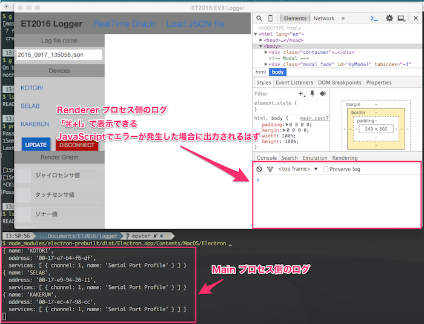

Electron 製の EV3 用ロガーです．

## 使い方

### 接続手順

#### EV3 側の準備

1. 電源をつける
2. `Load App` > `SD Card` > `selab` と選択し，アプリを起動
3. EV3 本体のソナーセンサが赤く光るまで待機
   - 本来は `connecting ...` と表示されるはずだが，現在はタスク周期の優先順位上表示されなくなってしまっている

#### アプリケーション側

1. `ET2016_Logger.app` を起動する
2. ログファイル名を設定する
   - 接続中に設定することも出来るが重いので，最初に設定してから接続するのが良い
3. デバイス一覧に接続先デバイスが存在する場合は，該当デバイスをクリックする
   - 存在しない場合は，`UPDATE` を押下しデバイスが表示されるのを待つ
   - 一度は必ず失敗するようなので，一度失敗してもめげずにもう一回クリックする
4. 接続されたら，リアルタイムにみたいログを `Render Graph` から選択する
   - ここで選択しなくても，裏では全てのログを記録しているので，後から見れる．リアルタイムに見たいものだけクリックすれば良い
   - 全グラフを表示しようとするとかなり重くなるので注意
5. ログを閲覧する
   - 前後の値の差が激しい場合のみラベルが表示される設定になっている
   - マウスカーソルを合わせると値の詳細が表示できるようになっている

### 切断手順

1. アプリケーション側で，`DISCONNECT` をクリックする
2. 切断できたら，EV3 の電源を切る

再度使用したい場合は，EV3 を再起動する必要がある．アプリケーション側は再起動する必要はないはず．

### ログ閲覧機能

ヘッダーの `Load JSON` をクリックするとログ閲覧画面を表示できる．
以下のような機能を持つ．


## バグフィックスについて

原因不明のバグを発見した場合には，レンダラプロセス側の Javascript のログを見ると良いかもしれません．
`.app` からでは確認できるようになっていないので，GitBucket からリポジトリをダウンロードし，ターミナルから起動する必要があります．

### 環境

- `node` : `v4.x`
- `npm`  : `v3.9.3`

`nvm` なり `nodebrew` なりを使用して，`v4.x` 系列の node.js をインストールすること．

### 手順

本リポジトリをクローンし，直下に移動する．

``` shell
$ git clone http://selpm.cis.ibaraki.ac.jp/gitbucket/git/ET2016/Logger.git
$ cd Logger
```

依存パッケージをインストールする．
`npm install` を実行すると，同階層のディレクトリ内にある `package.js` を読んで，依存関係にあるモジュールを自動的にインストールしてくれる．
モジュールは `node_module` というディレクトリ内にダウンロードされる．

``` shell
$ npm install
```

本アプリでは古いバージョンの Electron が必要となる．
`npm install` するとダウンロードされるようになっているので，該当パスに読みに行く．

``` shell
$ node_modules/electron-prebuilt/dist/Electron.app/Contents/MacOS/Electron .
```

または

``` shell
$ ./run.sh /dev.tty.[Name]SerialPortProfile
```

1. EV3 の電源をつける
2. Mac から，システム環境設定 > Bluetooth を選択
3. 一覧から該当するデバイスを見つけ，ペアリングする
   - 一瞬失敗しても，待っていれば繋がることがある
4. EV3 において LoadApp > SD Card > selab と選択し，EV3 側のアプリを起動
5. EV3 の画面に `connecting ...` と表示されるまで待機
6. 表示されたら，Mac から本アプリを起動する( `./run.sh /dev.tty.[Name]SerialPortProfile`)
7. 接続に成功すると，EV3 から音がする

### ログの参照

Electron は Main プロセスと Renderer プロセスが互いに非同期通信することで動作しています．

[Electronでipcを使ってプロセス間通信を行う - Qiita](http://qiita.com/Misumi_Rize/items/dde76dbf89abee13991c)

Main プロセス側のログはアプリを起動したターミナル上，Renderer プロセス側のログはGUIのコンソール上に出力されます．
GUIでコンソールを出すには，`⌘ + I` を押下します．



## パッケージングについて

`.app` を作成する方法を書いておきます．
基本的には以下の記事を参考にすれば良いです．

[30分で出来る、JavaScript (Electron) でデスクトップアプリを作って配布するまで - Qiita](http://qiita.com/nyanchu/items/15d514d9b9f87e5c0a29)

`homebrew` 当たりで `electron-packager` をいれて，以下のコマンドを実行すれば良いです．

``` shell
$ electron-packager ./logger ET2016-Logger --platform=darwin --arch=x64 --version=0.35.3 --icon=./logger/images/ET2016_Logger.icns
```

アイコンは `logger/images/ET2016_Logger.icns` にあります．
アイコンの作り方は以下の記事を参考にすれば良いです．

[Macアプリの.icnsを作るときのメモ - Qiita](http://qiita.com/Jacminik/items/a4c8fe20a4cba62f428b)

アイコン制作はイラストレーターが欲しいところですが，Keynote が割りと最強なので使うと良いと思います．
自分がアイコン作成に使用した keynote ファイルも `images` 以下にあげておきます．
